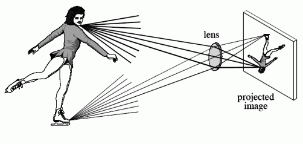
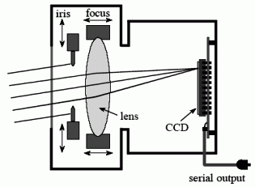
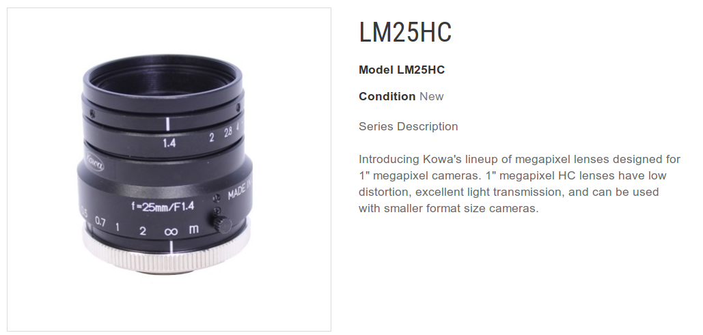
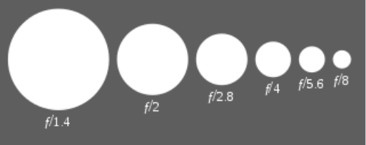
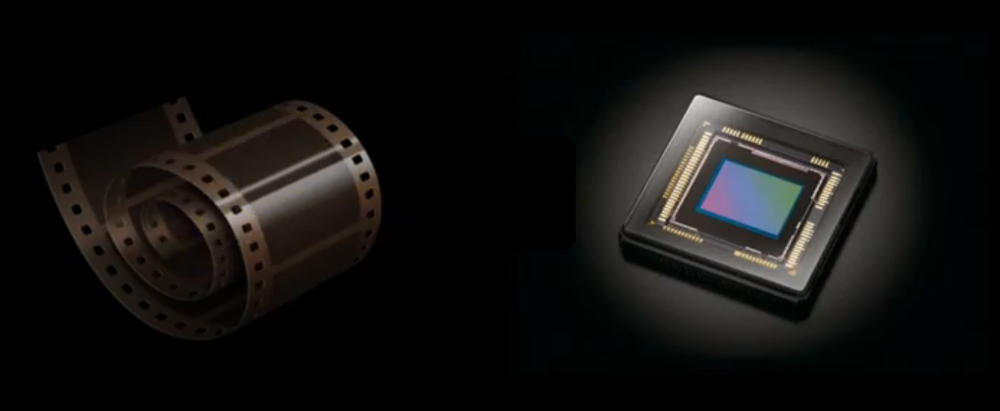
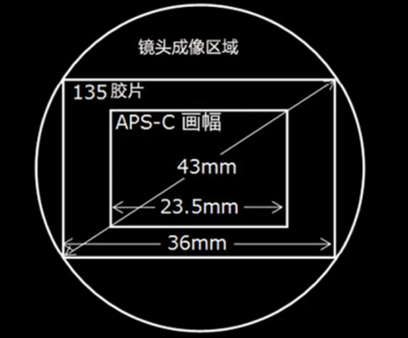

# 相机选型与相机的内参数、外参数、景深和地面分辨率的计算

## 引言

这是一篇实用研究报告，讲述了相机选型[^1]时需要的做的考量和相应的参数计算方法。为了在购买相机和镜头之前选择到合适的型号，我们需要进行相机选型，具体地，我们需要选择传感器和镜头的关键参数，参数的选择取决于应用的实际需求。

[^1]: 仅探讨定焦镜头的工业数码相机选型。

## 容易选择的参数

我们以BASLER相机的[在线选型工具](https://www.baslerweb.com/en/products/tools/vision-system-configurator/)为例，讲解那些可以轻易首先被筛选的参数，已经对这些参数有了解的朋友可以快速略过。BASLER的在线选型工具中指出我们需要选择传感器(Sensor[^2])、镜头(Lens)、电源线缆(Power Cable)、数据线缆(Data Cable)和附件(Accessories)，而本文只探讨传感器和镜头，剩下的部件选择不在探讨范围。

[^2]: 虽然BASLER的在线选型工具称之为相机(Camera)，为了和整体的相机相区分，在本文中我们约定称此部件为传感器(Sensor)，实际含义是指相机机身及其核心部件“感光芯片”。
容易选择的参数如下：

- Camera Category：选择Area Scan Cameras（面阵相机）。
- Interface（接口）：GigE（以太网）或USB3.0为机器视觉开发的首选接口，本例中选GigE；
- Lens Mount（镜头安装螺纹形式）：从几种预设的尺寸形式中选择最合适的尺寸，选型工具会筛选配套的机身和镜头，因此影响不大，本例中选C-mount；
- Shutter（快门）：分为Rolling Shutter（卷帘式）和Global（全局式）两种快门形式，卷帘式逐行曝光，全局式所有像素同时曝光，因此后者在高速运动场景下图像的失真小，但预算更高，根据应用场景是否涉及高速确定即可，本例中选Global；
- Frame Rate（帧率）：相机拍摄的速率，单位为帧每秒，可以依据算法需要选择适当高的帧率，本例设置帧率最低值为30fps；
- Mono/Color（黑白/彩色）：根据需要进行选择，同等技术条件下黑白相机会获得较高的成像质量，在对色彩不敏感的场合可以优先选用，本例中选Color。

筛选至此，我们的备选机身列表中就仅剩数款不同传感器型号品牌和不同像素尺寸大小的相机机身了，我们轻易地筛选掉了大多数不符合我们要求的相机机身！剩下的不那么容易确定的参数涉及到传感器的成像尺寸与镜头的配合，我们将在下一节选取其中一款备选的机身及其传感器，结合透镜的成像原理进行解释。

## 需要精细选择的参数

这部分，我们需要根据相机的成像原理，试算相机**等效针孔模型的内参数**，以便确定被拍摄对象处于这一针孔模型的视角范围内；我们还需要试算相机的**成像景深**，以便确保被拍摄对象处于可以清晰成像的深度范围内；我们还可以根据相机安装的位置和角度，试算相机**等效针孔模型的外参数**，以便计算某物体在图像上的所占的像素区域。

为什么要算这三样东西？只有当被拍摄对象处于视角内，我们才能完整地拍到它；只有当它还处于景深范围内，并且我们拥有足够大的像素面积来描绘这一图像对象时，我们才能清楚地拍到它。

由于相机的内参数受景深的影响，我们计算的顺序是依次是景深，内参数，外参数。但开始之前，我们需要明确相机的结构及其成像原理。

### 相机成像原理

凸透镜会将一定距离远外的物体（由无数的漫反射点光源构成）投影到一定距离远外的像平面上，使得同一个点光源反射的无数条光线还能在像平面上汇聚于一个点，这就是凸透镜成像原理：

$$
{1\over u}+{1\over v}={1\over f}
$$

式中$u$是物距，$v$是像距，$f$是镜头的固有参数：焦距，生产好的镜头的焦距即是确定下的值了。由于凸透镜在折射光线时有“经过光心光线传播方向不变”的定律[^3]，而同一点光源出射的所有的光线又都会汇聚在像平面上的同一点，因此我们在设计机器视觉算法时，就常常简化为目标物体上每个点只有一条光线经过光心成像在像平面上，这与小孔成像模型是等价的（孔足够小使得光线只有一条经过光心），与小孔成像模型对应的，计算出小孔成像的像距[^6]，结合后面讲解的传感器尺寸，也就很容易推导得出著名的相机内参矩阵了，关于这一点的具体计算我们放到后文中合适的地方进行。

[^3]:一束光在刚到达凸透镜的光心处之前，在第一个接触的表面会发生折射，然后在经过透镜，经过光心之后，从第二个表面出去，又会发生一次折射，因为这两个面关于光心是恰好对称的，所以两次折射恰好使射出光线和原光线平行（不重合）。但是为了方便，我们在学习时，为了方便，把透镜看成厚度不记的透镜（以后会学到厚度不可忽略的透镜），使通过光线方向不变，依然是一条直线。(来自知乎用户田伟的回答 https://www.zhihu.com/question/20759757/answer/77078447)
[^6]: 小孔成像模型中，焦距和像距都是指像距，不做区分，实际都是指像距，需要注意。（维基百科）

相机是利用凸透镜的成像原理制成的用于拍摄的机电装置，除了核心的镜头（lens）之外，其余部件的功能也都举足轻重。

位于暗室内的像平面，可以看作由采用微型光敏电容器的阵列构成的**感光芯片**（Sensor）充当，图像中有多少个像素，拍摄时采用的感光芯片就包含相应数量和位置的电容器阵列，在一个曝光时间内，每个电容器独立地将其微小平面上的所接受到的平均光强信号转换为电压信号输出，再交由模数转换电路进行处理，芯片有CCD和CMOS两种制作的技术方案，它们大同小异。感光芯片具有一定的物理尺寸和像素尺寸，结合小孔成像模型的焦距，可以估算得出相机的内参矩阵。

仔细观察凸透镜成像公式可以发现，焦距固定时，对于不同距离的点光源，需要调整获得不同的像平面距离才能使得无数条光线汇聚于传感器（幕布）上的同一个点而不是一个圆形区域上（这样必然造成模糊），相机中的对焦器（focus）可以移动镜头相对于传感器的距离，调整像距，来使得对不同距离的物体拍摄时都清晰，这就是**对焦**（focus）[^4]的过程，当对焦于某距离的物体，使得该物体的前后一段深度的景物是足够清晰的，这段距离就称之为**景深**（depth of view）[^5]，通用的机器视觉算法常常部署在已经对好焦的相机上，因此对于不同距离的物体，也可能要使用多个相机分别拍摄。

在相机最外层的**光圈**（iris），就像人的眼睑，可以减少相机的进光量，这不只是用于调节画面的明暗！当调节光圈使进光量变小时，由于不同角度的光线进入地较少了，当对焦（像距调整）不准确时，图像也不容易模糊了，也就是说图像清晰度对于像距的偏差不敏感了。

[^4]:**对焦**（**Focus**）是一个[摄影](https://zh.wikipedia.org/wiki/摄影)术语，即使用[照相机](https://zh.wikipedia.org/wiki/照相机)拍照前调整好焦点的距离，以使拍出来的照片清晰。其基本原理是：通过相机[镜头](https://zh.wikipedia.org/wiki/镜头)中镜片组的前后移动，改变[像距](https://zh.wikipedia.org/w/index.php?title=像距&action=edit&redlink=1)的位置，使物像恰好落在底片或[感光元件](https://zh.wikipedia.org/wiki/感光元件)上。现在的数码单反相机的自动对焦系统一般为通过反差检测来确定画面是否合焦，即通过镜头镜片组的移动，在画面上寻找反差（对比度）最高的点，将反差最大的点作为合焦点。（维基百科）
[^5]:在空間中，可以清楚成像的距離範圍；雖然[透鏡](https://zh.wikipedia.org/wiki/鏡頭)只能夠將光聚到某一固定的距離，遠離此點則會逐漸模糊，但是在某一段特定的距離內，影像模糊的程度是肉眼無法察覺的，這段距離稱之為 **景深** 。當焦點設在[超焦距](https://zh.wikipedia.org/wiki/超焦距)处時，景深會從超焦距的一半延伸到無限遠，對一個固定的光圈值來說，這是最大的景深。（维基百科） 作者按：超焦距是物距的一种，不是焦距，对焦距离也是指物距，在英文单词中，focus是指对焦（距），focal是指透镜焦距，需要注意区分。

为了清楚地拍到图像，我们需要定量确定光圈和对焦的取值，它们共同确定了相机拍摄时的景深，公式我们放在后文中详细讨论。下图展示了一个真实的镜头，可以通过前文提到的BASLER相机选型工具找到，其参数表选录于下。图中从上往下看，镜头的外圈是光圈，内圈是对焦器，再往下就是螺纹了。

| 参数名称                                  | 参数值                 |
| ----------------------------------------- | ---------------------- |
| 焦距 Focal Length                         | 25mm                   |
| Lens Type                                 | Fixed Focal Length     |
| 成像尺寸Image Size                        | 1" (12.8 x 9.6 x 16mm) |
| 光圈范围Iris Range (F-Stop)               | F1.4 - 16              |
| Angle of View 1/1.8" (Hor. x Ver. x Dia.) | 16.5 x 12.4 x 20.6°    |
| Angle of View 2/3" (Hor. x Ver. x Dia.)   | 20.2 x 15.1 x 25.2°    |
| Angle of View 1" (Hor. x Ver. x Dia.)     | 29.3 x 22.0 x 36.6°    |
| 最小景深 Focusing Range                   | 0.3m                   |
| Mount                                     | C-mount                |

对于光圈，常常见到的是“f/#标记法”，例如F/1.4，F/1.8等等，后面“#”代表的数字称为光圈数，常用字母N表示，是指**光圈的实际直径是**$D=f/N$​，这就给出了示数与光圈直径的计算公式了。光圈不是连续可调的，下图中光圈数逐渐增加$\sqrt{2}$倍，进光面积逐渐缩小一半。

### 根据光圈和物距计算像距和景深

### 根据像距和传感器尺寸计算相机的内参数和视场角

### 根据相机的安装位姿计算相机的外参数和投影矩阵

视场角

图像传感器、全画幅

